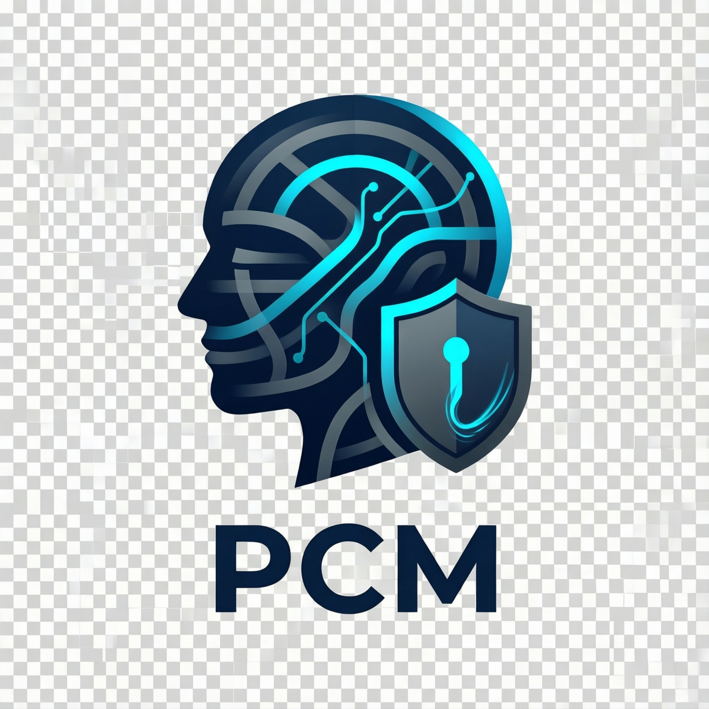

<p align="center">
  
</p>

# PCM - Profile & Consent Manager

> **An open-source, privacy-first identity & consent platform for modern social applications**

[](LICENSE)
[](https://openjdk.org/projects/jdk/21/)
[](https://spring.io/projects/spring-boot)

---

## 🚀 Quick Start

```bash
# Clone the repository
git clone https://github.com/vibe-afrika/pcm.git
cd pcm

# Start infrastructure (PostgreSQL, Redis, Kafka, Elasticsearch)
docker-compose up -d

# Build all services
mvn clean install -DskipTests

# Run the API Gateway & core services
cd api-gateway && mvn spring-boot:run
```

Refer to the [**Quick Start Guide**](docs/QUICKSTART.md) for detailed onboarding.

---

## 📖 Overview

**PCM** is a modular, event-driven microservice suite that serves as the **single source of truth** for user profiles and GDPR-compliant consent management.

- ✅ **Open source** (Apache 2.0)
- ✅ **Privacy-by-design** (Immutable consent ledger, orchestrated erasure)
- ✅ **Cloud-native** (Kubernetes-ready, Kafka event-driven, stateless)
- ✅ **High Performance** (gRPC aggregation at the gateway layer)
- ✅ **Compliant** with GDPR, ePrivacy, and emerging data laws

---

## 📜 The Genesis: From Complexity to Clarity

PCM did not come from nowhere. It emerged from a concrete challenge within a social project for a startup.

### 1. The Initial Candidate: Apache Unomi
We initially chose [Apache Unomi](https://unomi.apache.org/) as our Customer Data Platform (CDP). It offered a comprehensive suite for profile tracking and real-time segmentation.

### 2. The Limits of Heavy Machinery
As our requirements for **Data Sovereignty** and **Extreme Security** grew, we encountered significant friction:
- **Operational Complexity**: The Apache Karaf/OSGi architecture added heavy overhead and a steep learning curve for our team.
- **Security-by-Design**: We needed native, transparent PII encryption (via HashiCorp Vault) as a foundational layer, which was difficult to "bolt on" to an existing engine.
- **Infrastructure Overhead**: A mandatory Elasticsearch dependency for all profile operations was overkill for our primary identity management needs.

### 3. The Pivot to PCM
We decided to build a platform that focused on the core: **Identity, Consent, and Protection**. By leveraging **Spring Boot 3**, **gRPC**, and **HashiCorp Vault**, we created a lean, high-performance alternative that prioritizes the **Security of the Citizen's Data** above all else.

Today, PCM is open-sourced to empower other developers facing similar challenges in building privacy-first applications.

---

## 🧩 Architecture

PCM uses **Hexagonal Architecture** with clear **bounded contexts**, standardized on **Spring Boot 3.2** for consistency and performance:

| Service | Responsibility | Stack |
|---------|----------------|-------|
| **Profile Service** | User identity, handle management, dynamic attributes | PostgreSQL (JSONB), Redis |
| **Consent Service** | GDPR consent collection, versioning, legal proof | PostgreSQL (Ledger) |
| **Segment Service** | User classification and real-time segmentation | Elasticsearch, Kafka |
| **Preference Service** | UX preferences (language, theme, notifications) | Redis |
| **Config Service** | Centralized configuration for the entire platform | Spring Cloud Config |
| **API Gateway** | Unified entry point, JWT security, Aggregator | Spring Cloud Gateway, gRPC |

### Communication

- **Synchronous**: gRPC for high-performance data aggregation (Gateway -> Services)
- **Asynchronous**: Kafka with Avro schemas for cross-service events (e.g., GDPR Erasure)
- **Security**: JWT for client authentication, standard OAuth2 resources server

---

## 🏗️ Project Structure

```
pcm/
├── libs/
│   ├── common/              # Shared domain interfaces, value objects
│   ├── kafka-events/        # Avro event schemas
│   └── grpc-contracts/      # Protobuf service definitions
├── profile-service/         # Spring Boot - Profile management
├── consent-service/         # Spring Boot - Consent ledger
├── segment-service/         # Spring Boot - User segmentation
├── preference-service/      # Spring Boot - User preferences
├── config-service/          # Spring Boot - Centralized Configuration Server
├── api-gateway/             # Spring Cloud Gateway & Aggregator
├── k8s/                     # Raw Kubernetes manifests
├── charts/                  # Helm charts for Kubernetes
├── docs/                    # Architecture Decision Records (ADRs) & Guides
└── docker-compose.yml       # Local development environment
```

---

## ⚙️ Configuration
PCM uses a centralized configuration model via **Spring Cloud Config**. All core platform settings (Kafka, Redis, Vault, Logging) are managed in the `config-service`.

- **Source of truth**: `config-service/src/main/resources/config/`
- **Shared config**: `application.yml`
- **Service specific**: `<service-name>.yml`
---

## 📚 Documentation

- [**Quick Start Guide**](docs/QUICKSTART.md) - Get PCM running locally in 5 minutes.
- [**API Reference**](docs/API_REFERENCE.md) - Endpoints, payloads, and examples.
- [**Dependency Monitoring**](docs/DEPENDENCY_MONITORING.md) - Guide to monitoring updates and vulnerabilities.
- [**Architecture Decision Records**](docs/architecture/) - Design decisions and rationale.
---

## 📝 Notes

> [!NOTE]
> The `config-service` must be started **before** other microservices as they fetch their configuration at startup.

> [!NOTE]
> The logo was generated using the following prompt:
> A modern, high-tech logo for an open-source platform named 'PCM' (Profile & Consent Manager). The design should feature a stylized digital profile head and a shield or padlock to represent privacy and consent. Use a professional color palette like deep blue, vibrant cyan, and slate grey. The aesthetic should be clean, minimalist, and premium, suitable for a GitHub header. No text other than 'PCM'. White background or transparent-like aesthetic.

